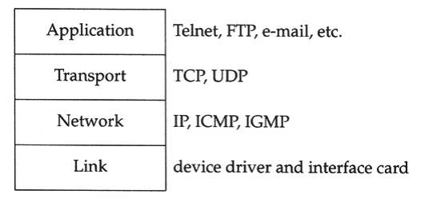
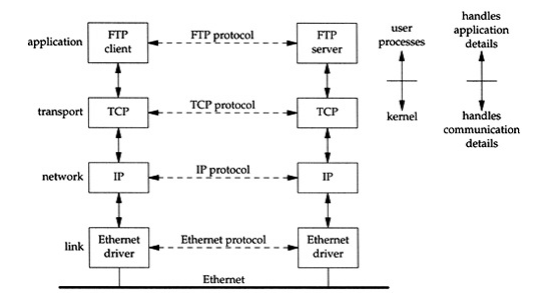
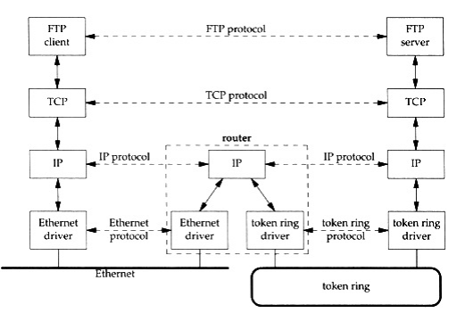
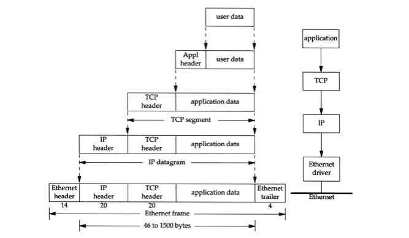

## Layering
TCP/IP consist of 4 layers:

#### Link layer
Link layer consist of NIC and device driver which is used by OS to talk to the physical interface. This layer is responsible for sending bits to the wire.

#### Network layer
Also called `Internet layer` and is responsible for "*moving*" packets. Routing, for example.

#### Transport layer
Provides a way for packets to "*move*". TCP/IP has 2 transport layer protocols, TCP and UDP. TCP is reliable way of transferring packets, and UDP is unreliable.

#### Application layer
It's layer where such protocols as HTTP, FTP, SMTP works. Each of these will treat the data on its own way.

### User space handling
It seems that only Application layer is working in user space and the rest of the 3 layers is handled by the kernel. It's in most cases but it's not a requirement. As an example where all layers are handled at user space is DPDK

### Difference between Network & Transport layers
It's obvious why we need Link layer and Application Layer. But why do we need both Network layer and Transport layer?

There can be many types of physical networks:
- Ethernet
- Token ring
- Point-to-point

And there is a router, which can provide connection between different types of networks and it uses Network layer.

[[Network layer is all about moving packets, even through 20 different networks. For example, there could be 20 of those routers and Network layer will lead the packets through all of them.

**BUT**, Network layer does not guarantee, that packets will reach their destination. This is the responsibility of Transport layer.

## Internet Address
Each device on the internet must have their unique address. It's called an IP Address and consist of 32 bits. They are represented in 4 decimal number of 8 bits each - `192.168.0.1`

## Domain Name System
It's easier for us to remember `google.com` instead of `173.194.220.139`. So that's what DNS is all about. Giving names to IP Addresses.

## Encapsulation
Whenever an Internet packet is formed, it goes through each layer, and each layer adds it's own header (and sometimes trailer in case of Ethernet).

Each layer will take data from above, add own header and form it into a unit. These units have different names depending on the layer/protocol:

`TCP` - `TCP segment`
`UDP` - `UDP datagram`
`IP` - `IP datagram`
`Ethernet` - `frame`

## Demultiplexing
It's a process opposite to `Encapsulation`, where a destination host receives a packet. Again, each layer removes it's header and is treated by the appropriate `protocol box`. It's header data is then used to determine `protocol box`  for the next layer.

## Client-Server Model
Most services in the internet work in Client-Server Model. **Generally**, `Client` is the user and `Server` is the service which user is accessing.

Servers can be in `iterative` and `concurrent`.

`Iterative` servers handles each request one by one, whereas `Concurrent` servers "*spawns a new server*" for each client. New server can be a thread, process or a task. When request is complete, this *new server* is terminated.

## Port numbers
Transport layers choose specific application based on Port number. Port is a 16-bit number.

Ports from 1-1023 are considered as "*well known*" ports. For example, port 80 is used by HTTP and port 443 is used by HTTPS.
